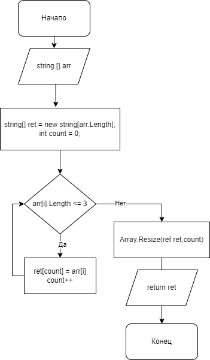

Итоговая контрольная работа по основному блоку

# Урок 1. Контрольная работа

## Задача алгоритмически не самая сложная, однако для полноценного выполнения проверочной работы необходимо:

1. Создать репозиторий на GitHub
2. Нарисовать блок-схему алгоритма (можно обойтись блок-схемой основной содержательной части, если вы выделяете её в отдельный метод)
3. Снабдить репозиторий оформленным текстовым описанием решения (файл README.md)
4. Написать программу, решающую поставленную задачу
5. Использовать контроль версий в работе над этим небольшим проектом (не должно быть так, что всё залито одним коммитом, как минимум этапы 2, 3, и 4 должны быть расположены в разных коммитах)

# Решение:

1. Создаем алгоритм (рисуем блок-схему)



Опиание:
Осноной метод возращает массив string, в цыкле for сравнивается длинна каждого элемента массива меньше или равно 3. Если верно, записываем во второй массив с индексом count и увеличиваем count. После выхода из цикла уменьшаем длинну массива.

```
Входной массив:
2557,45,hello,world,res,456,
Результат:
45,res,456,
```


